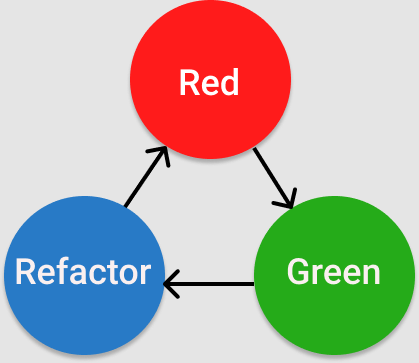

# W2D3 (Error Handling and TDD)

## Error Handling

### Error Handling Practices (40m)

- Error Types Quiz
- Error Handling Quiz
- Error Handling Practice

### Error Handling Discussion

- Purpose of Error Handling
- One thing to note about Syntax Errors is that many of them can't be caught using try catch blocks.

```js
try {
  // statements that will be attempted here
} catch (error) {
  // if an error is thrown it will be "caught"
  // allowing the program to continue execution
  // these statements will be run and the program will continue!
}

```

```js
const add = (num1, num2) => num1 + num2;
add("banana", "orange");
```

```js
const add = (num1, num) => {
  try {
    return num1 + num2;
  } catch (e) {
    console.error(e.message);
  }
};
add("banana", "orange");
```

### TDD Practices

- Testing Pyramid Quiz
- TDD Quiz
- Mocha and Chai Quiz
- Unit Tests with Mocha and Chai Practice

### TDD Discussion

Testing Pyramid


- Unit Tests: Smallest unit of testing. Focuses on individual functions or tasks
  individually.
- Integration Tests: Testing how separate pieces of code work with one another.
- End-to-End Tests: Tests the whole application, high level functionality, close
  to the user experience.

TDD Process



- Red: Write tests, watch them fail
- Green: Write code, just enough to pass the previously written tests.
- Refactor: Write more tests, watch them fail, pass the tests. The loop of
  easily maintainable, fully tested, clean code.